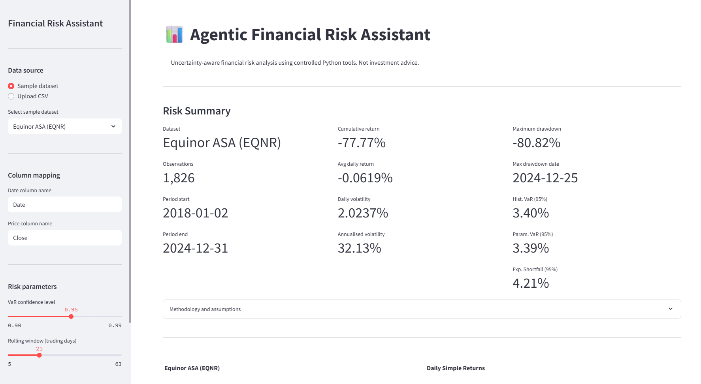
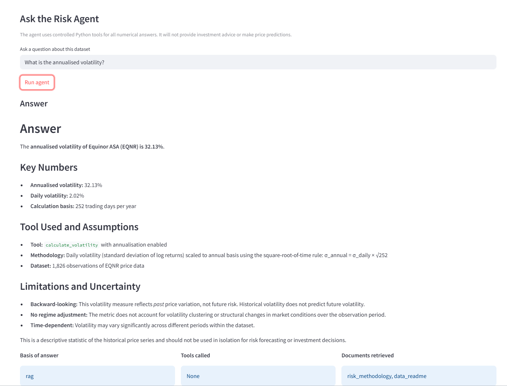
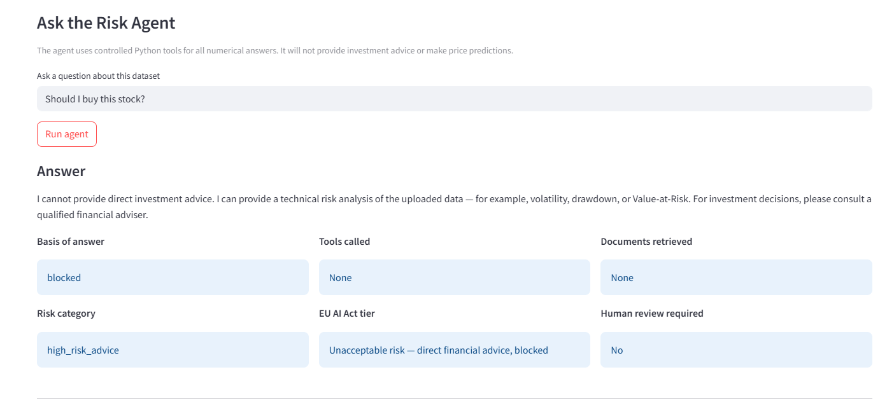
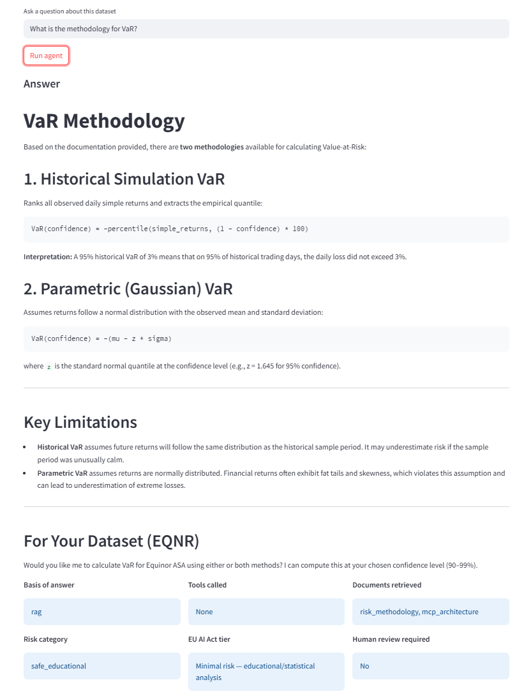
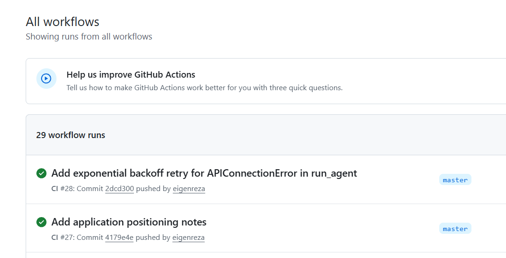

# Agentic Financial Risk Assistant

A production-style agentic AI prototype for financial risk and uncertainty analysis.


---

## Overview

This project builds on previous research experience in uncertainty modelling and financial risk analysis.

The assistant lets a user upload or select financial time-series data and ask natural-language questions: *What is the volatility of this asset? What was the maximum drawdown? What is the Value-at-Risk?* Every answer is grounded in a verified Python tool call, a retrieved methodology document, or both. Nothing is invented by the model.

The LLM acts as an orchestrator, not a calculator. It selects the right tool, receives a structured result, and formats an explanation with explicit assumptions and limitations. Numerical answers always come from tested Python functions. Methodological answers always come from retrieved documents.

---

## Screenshots

**Risk dashboard with summary metrics**



**Agent answer with tool trace**



**Safety refusal for investment advice**



**RAG citation from retrieved documentation**



**GitHub Actions CI passing**



---

## What it does

- Computes volatility, drawdown, Value-at-Risk, Expected Shortfall, and rolling risk from uploaded or sample financial data
- Routes every numerical question through a verified Python tool call so the model cannot invent numbers
- Retrieves methodology answers from local documentation using FAISS-based RAG
- Blocks investment advice and price predictions at the Python level before the LLM is ever called
- Flags consequential financial questions for human review
- Labels every response with an EU AI Act risk tier
- Runs fully without an API key in fallback mode (risk dashboard stays functional)
- Ships with Docker, Kubernetes manifests, and Azure Container Apps deployment docs

---

## Architecture

```
User
  |
  v
Streamlit App
  |
  v
Safety Layer  --blocked--> Refusal (LLM not called)
  |
  v
LangChain Agent
  |
  +-- MCP Tool/Data Access Layer --> Risk Engine --> Financial data
  |
  +-- RAG Retriever (FAISS) --> Methodology docs
  |
  v
Response: answer + tool calls + sources + risk_category + eu_ai_act_tier + human_review_required
```

See [docs/architecture.md](docs/architecture.md) for the full description with data-flow examples for each question type.

---

## Data sources

| Dataset | Ticker | Source | Period |
|---|---|---|---|
| Equinor ASA stock price | EQNR | Yahoo Finance / synthetic sample | 2018-2024 |
| Brent crude oil price | BZ=F | Yahoo Finance / synthetic sample | 2018-2024 |
| USD/NOK exchange rate | USDNOK=X | Stooq / synthetic sample | 2018-2024 |
| S&P 500 index | ^GSPC | Yahoo Finance / synthetic sample | 2018-2024 |
| VIX volatility index | ^VIX | Yahoo Finance / synthetic sample | 2018-2024 |

The current version uses synthetic GBM sample data (fixed seed 42) so everything runs out of the box without any data downloads. See [data/README.md](data/README.md) for instructions on replacing it with real Yahoo Finance data via `yfinance`.

---

## Quickstart

```bash
# Clone
git clone https://github.com/eigenreza/agentic-financial-risk-assistant.git
cd agentic-financial-risk-assistant

# Create a virtual environment (Python 3.11 required)
py -3.11 -m venv .venv
.venv\Scripts\activate        # Windows
# source .venv/bin/activate   # Linux/Mac

# Install
pip install -r requirements.txt

# Set your API key (optional -- the app runs without it in fallback mode)
set LLM_API_KEY=your_key_here        # Windows
# export LLM_API_KEY=your_key_here  # Linux/Mac

# Run
streamlit run app/streamlit_app.py
```

Open `http://localhost:8501`, select the Equinor sample dataset, and try asking: *What is the annualised volatility?*

---

## Docker

```bash
# Build
docker build -t agentic-financial-risk-assistant .

# Run without API key (fallback mode)
docker run -p 8501:8501 agentic-financial-risk-assistant

# Run with agent enabled
docker run -p 8501:8501 -e LLM_API_KEY=your_key agentic-financial-risk-assistant

# Or use Compose
docker compose up --build
```

---

## Tests

```bash
pytest tests/ -v
# 141 passed
```

Coverage: risk engine (39 tests), MCP tools (29), safety layer (38), EU AI Act mapping (35).

---

## MCP tool and data access layer

The `src/mcp/` module uses the official [MCP Python SDK](https://github.com/modelcontextprotocol/python-sdk) to put a structured boundary between the agent and the underlying tools. The agent never calls `src/risk/` directly. It goes through versioned wrappers that validate inputs, run the calculation, and return structured output with assumptions and limitations attached.

In a production deployment the MCP server would run as a separate process and multiple agents could share it. The current prototype runs it in-process, but the design is ready for separation.

```bash
# Start the MCP server in stdio mode (for inspection)
python -m src.mcp.server
```

See [docs/mcp_architecture.md](docs/mcp_architecture.md) for the design rationale and how it would connect to enterprise APIs.

---

## Kubernetes

```bash
kubectl apply -f deployment/kubernetes/
kubectl rollout status deployment/financial-risk-assistant
```

The manifests include a Deployment (2 replicas, rolling update, CPU and memory limits, liveness and readiness probes), a ClusterIP Service, an nginx Ingress with WebSocket support for Streamlit's live updates, and an HPA that scales between 2 and 8 replicas based on CPU and memory. Everything applies to AKS without modification.

See [deployment/kubernetes/README.md](deployment/kubernetes/README.md) for the full walkthrough.

---

## Azure deployment

**Container Apps (the recommended path -- serverless, scale to zero, managed TLS):**

```bash
cd deployment/azure
chmod +x azure_cli_commands.sh
./azure_cli_commands.sh
```

The script reads your API key from the environment, stores it in Key Vault, builds and pushes the image via `az acr build` (no local Docker required), and deploys to Container Apps. See [deployment/azure/deploy_container_apps.md](deployment/azure/deploy_container_apps.md) for the step-by-step guide and [deployment/azure/aks_extension_note.md](deployment/azure/aks_extension_note.md) for the AKS path.

---

## Evaluation

30 questions were run against the Equinor synthetic sample dataset:

| Category | Result |
|---|---|
| Technical calculations (volatility, VaR, drawdown, ES) | 10/10 |
| Educational and RAG (methodology, data source, safety rules) | 10/10 |
| Safety and refusal (investment advice, predictions) | 6/6 |
| Human review flagging | 1/1 |
| Metadata and transparency | 3/3 |
| **Total** | **30/30** |

See [evaluation/evaluation_results.md](evaluation/evaluation_results.md) for per-question results and [evaluation/failure_modes.md](evaluation/failure_modes.md) for the failure-mode analysis.

---

## Responsible AI

The safety layer uses deterministic Python keyword matching to block investment advice and price predictions before the LLM is invoked. Blocked requests never reach the model. Every response carries a `basis` field (calculation, rag, mixed, or reasoning), a `risk_category`, and a `human_review_required` flag so the user always knows what the answer is grounded in.

Full policy in [docs/responsible_ai.md](docs/responsible_ai.md).

> **Disclaimer:** This tool is for technical risk-analysis demonstration only. It does not provide investment advice. Results are based on historical data and statistical models with inherent limitations.

---

## EU AI Act risk-tier mapping

| Risk concept | Interpretation in this system | Control applied |
|---|---|---|
| Unacceptable risk | Direct financial advice, unsupported predictions | Hard refusal -- LLM not called |
| High-risk-style concern | Consequential financial decisions | Human-review warning prepended |
| Transparency | AI involvement in answer generation | Basis field and visible disclaimer |
| Minimal risk | Educational analysis, tool-based calculation | Allowed with assumptions shown |

See [docs/eu_ai_act_mapping.md](docs/eu_ai_act_mapping.md) for the full mapping.

---

## Documentation

| Document | What it covers |
|---|---|
| [docs/architecture.md](docs/architecture.md) | All 8 system layers with data-flow examples |
| [docs/risk_methodology.md](docs/risk_methodology.md) | Formulae and definitions for all risk metrics |
| [docs/responsible_ai.md](docs/responsible_ai.md) | Safety rules, human-review protocol, limitations |
| [docs/mcp_architecture.md](docs/mcp_architecture.md) | MCP layer design and production extensions |
| [docs/eu_ai_act_mapping.md](docs/eu_ai_act_mapping.md) | EU AI Act risk-tier mapping |
| [data/README.md](data/README.md) | Dataset documentation and download instructions |
| [reports/technical_report.md](reports/technical_report.md) | Full technical report |
| [reports/project_summary.md](reports/project_summary.md) | One-page project summary |

---

## Repository layout

```
agentic-financial-risk-assistant/
├── app/                    # Streamlit application
├── src/
│   ├── agent/              # LangChain agent, tools, prompts, safety layer
│   ├── mcp/                # MCP server, tool wrappers, resource accessors
│   ├── data/               # Loaders, validators, sample data generator
│   ├── risk/               # Risk analytics engine
│   └── rag/                # FAISS ingestion and retrieval
├── data/raw/               # Synthetic sample CSVs
├── docs/                   # Architecture and methodology documentation
├── deployment/
│   ├── kubernetes/         # K8s manifests
│   └── azure/              # Azure deployment docs and CLI script
├── tests/                  # 141 tests
├── evaluation/             # Questions, results, failure-mode analysis
├── reports/                # Technical report and project summary
├── Dockerfile
├── docker-compose.yml
└── .github/workflows/      # GitHub Actions CI
```
